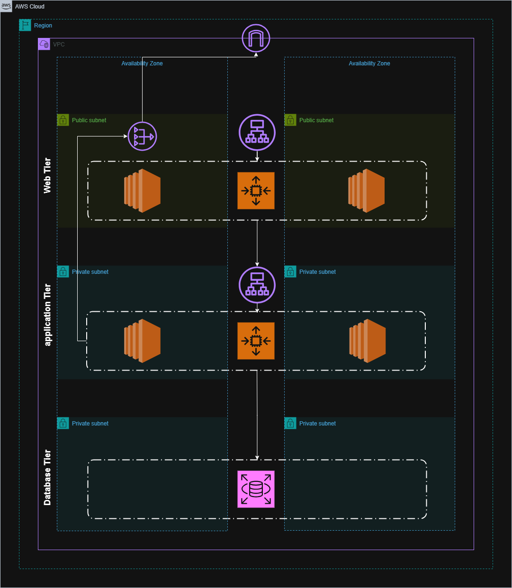

# Terraform Multi-Module Infrastructure Project

## Overview

This Terraform project provisions a cloud infrastructure using multiple reusable modules to manage compute resources, networking, security groups, load balancing, storage, and key pairs.
## Architecture Diagram


---

## Usage

1. Clone the repository.

2. Provide necessary variables, preferably in a `terraform.tfvars` file or via environment variables.

3. Initialize Terraform:

    ```bash
    terraform init
    ```

4. Validate the configuration:

    ```bash
    terraform validate
    ```

5. Preview the planned resources:

    ```bash
    terraform plan
    ```

6. Apply the configuration:

    ```bash
    terraform apply
    ```

---

